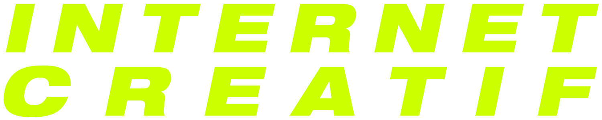

# internet créatif: des sites cools par des personnes créatif.ves

## sites de chercheur.euse.s et de recherche

- [designSHS](https://laboratoire-graphique.fr/): ANR en graphisme et sciences sociales
- [anthony masure](https://www.anthonymasure.com/): recherche en design
- [softphd.com](http://www.softphd.com/): thèse en site. tentative de développer une mise en page
  *web native* pour une thèse. refléxions sur les manières d'unifier publication papier et web.
- [back office](http://www.revue-backoffice.com/): revue *peer reviewed* sur le design, avec une
  orientation très théorique/politique

## sites de designers
- [e+k](http://www.e-k.fr/): design et web design. design du magasine *Back Office*, du site *DesignSHS*...
- [passages[...]](https://passages.site/): design du site du Musée de la Chasse et de la Nature. design sympa
  avec une refléxion sur la représentation du texte de manière dynamique.
- [stephen lumenta](https://stephenlumenta.com/): programmeur sur le site d'Isa Melsheimer, design ridiculement 
  simple mais efficace : )

## sites d'artistes, musicien.ne.s et labels

- [isa melsheimer](https://isamelsheimer.com/): artiste. site très contre-intuitif : )
- [mohammed boursuissa](https://www.mohamedbourouissa.com/): <3 sur l'artiste 
- [pc music](https://pcmusic.info/): magnifique bleu et magnifique transition du logo pleine-page à banner au début
